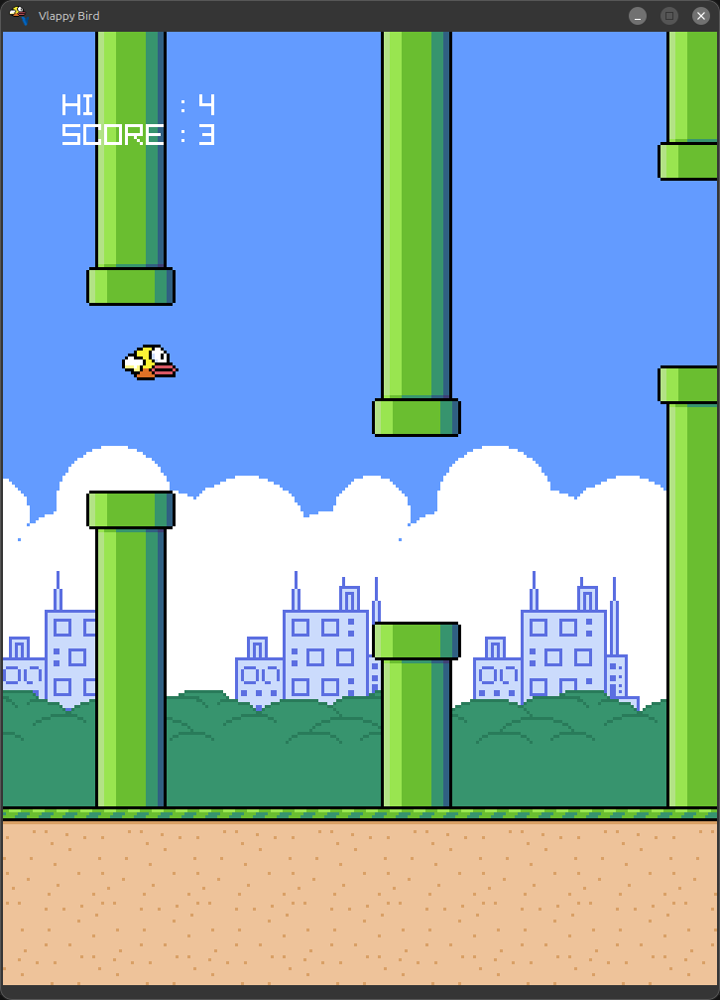

#  Vlappy Bird
A simple flappy bird clone made using V and raylib

<div style="text-align:center">

</div>

## How to play
Press `[Space]` to flap higher

Don't collide with the pipes or the ground, that's it.

Score will be added everytime you passed a pipe

## Debugs
- Press `[F]` to show FPS
- Press `[D]` to show collider rects

## System Requirements
- 4MB of Storage
- 32MB of RAM
- 8MB of VRAM
- 500MHz CPU ( x86 )
- OpenGL 3.3 or newer
- Screen with at least 720x960 ( can be changed from code )

### Benchmark Result
```text
[ MACHINE ]
OS       : Kubuntu 25.04
CPU      : Intel Core i7-6700
GPU      : NVIDIA RTX 2060 6GB ( Proprietary Driver 575.64.03 )
RAM      : 32GB DDR4
SSD      : Teamgroup CX2 1TB ( SATA 3 )
COMPILER : V 0.4.11 c3dfe62, Clang 20.1.2
LIBC     : 2.41
KERNEL   : Linux 6.14.0-23-generic
DE       : KDE Plasma 6.3.4
WM       : KWin ( Wayland ), game run on XWayland
DISPLAY  : Samsung S23C350 1920x1080 60Hz

[ RESULT ]
Resolution  : 240x320 ( Upscaled to 720x960 )
Average FPS : 4234 FPS
1% Minimum  : 892  FPS
1% Maximum  : 4573 FPS
```

## Building
### Pre-requisites
- V Compiler ( tested on 0.4.11 c3dfe62 )
- Any C Compiler ( tinycc, gcc or clang )
  - MSVC isn't tested yet, but should work in theory
- `raylib` V package

### Steps
```
git clone https://github.com/PSWGameWorkID/vlappy
cd vlappy
v -prod .
```

For further size opimitization, you can add flags like `-fast-math`, `-d no_segfault_handler`, and `compress` ( this one needs upx ).

The game is pretty much standalone and self-contained 
( including the assets ), so you can just move the executable
( and `config.json` if any ) around and it would pretty much flawlessly run.

## License
MIT License, see [LICENSE.MD](LICENSE.MD)